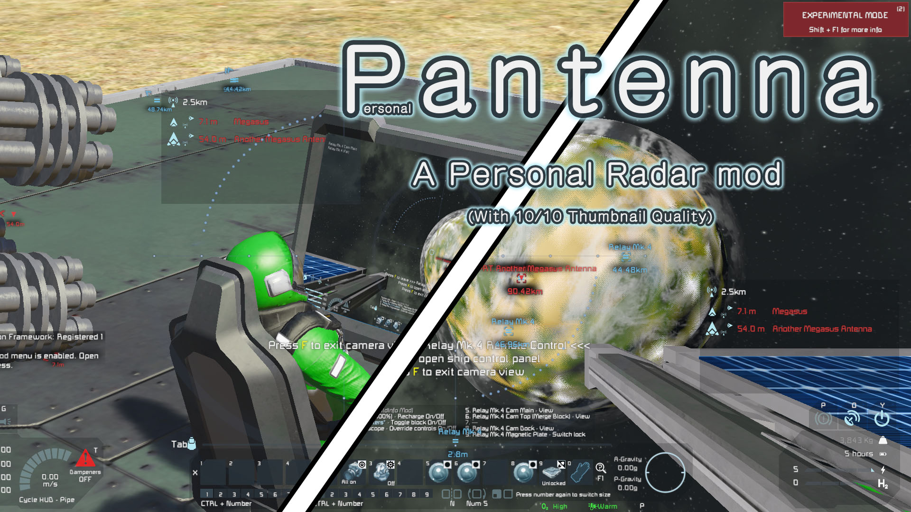

# Pantenna
This is the official repository for Pantenna mod for Keen Software House's "Space Engineers" game.\
This mod will be a part of my "Back to the reality" modpack? challenge?, in which the Engineer stays on Earthlike planet most of their time.

# Mod Detail

This mod add a display on the Engineer's HUD to show the nearest 5 (max 5) enemy signals to them.\
This display will be useful when the Engineer is controlling a Remote Control block far away from them. 

Link to mod: [Steam](https://steamcommunity.com/sharedfiles/filedetails/?id=2655275786)

# Version
Current version:
- v1.3
